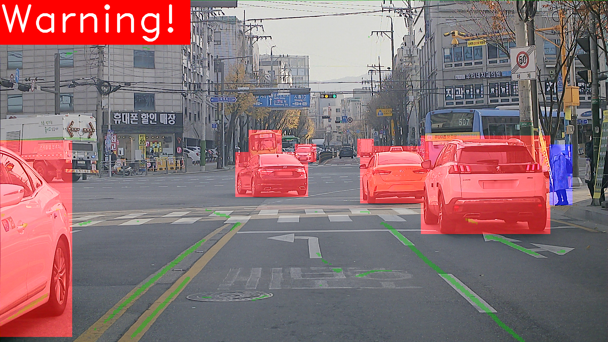

# KW_ADAS
Advanced Dirver Assistance System

## 필요 library 설치
```
pip install -r requirements.txt
```

## 사용한 데이터 셋
-[line segmentation](https://www.kaggle.com/datasets/thomasfermi/lane-detection-for-carla-driving-simulator)
-[detection](https://aihub.or.kr/aihubdata/data/view.do?currMenu=115&topMenu=100&dataSetSn=195)

## Result
```
python inference.py
```


